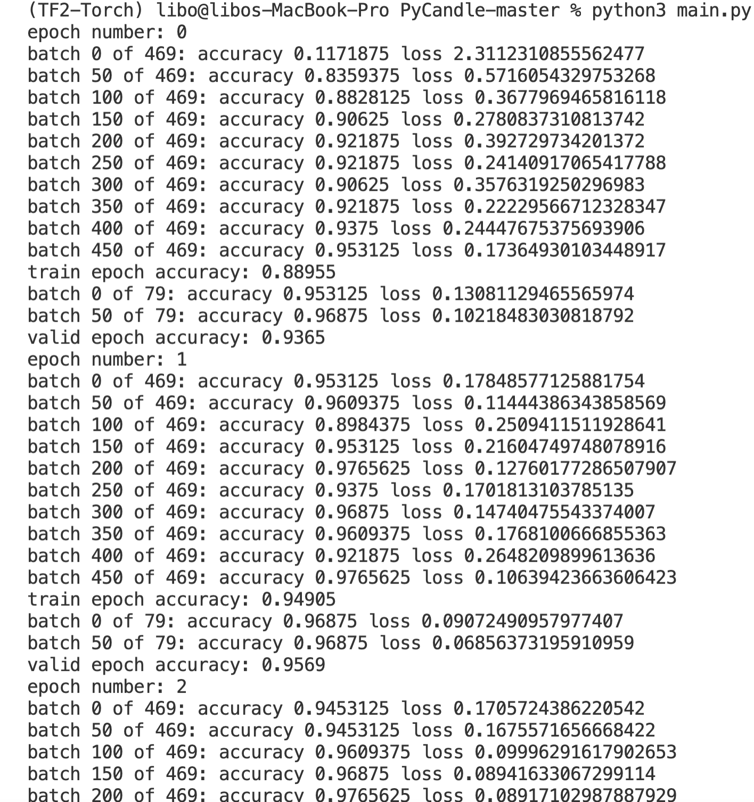
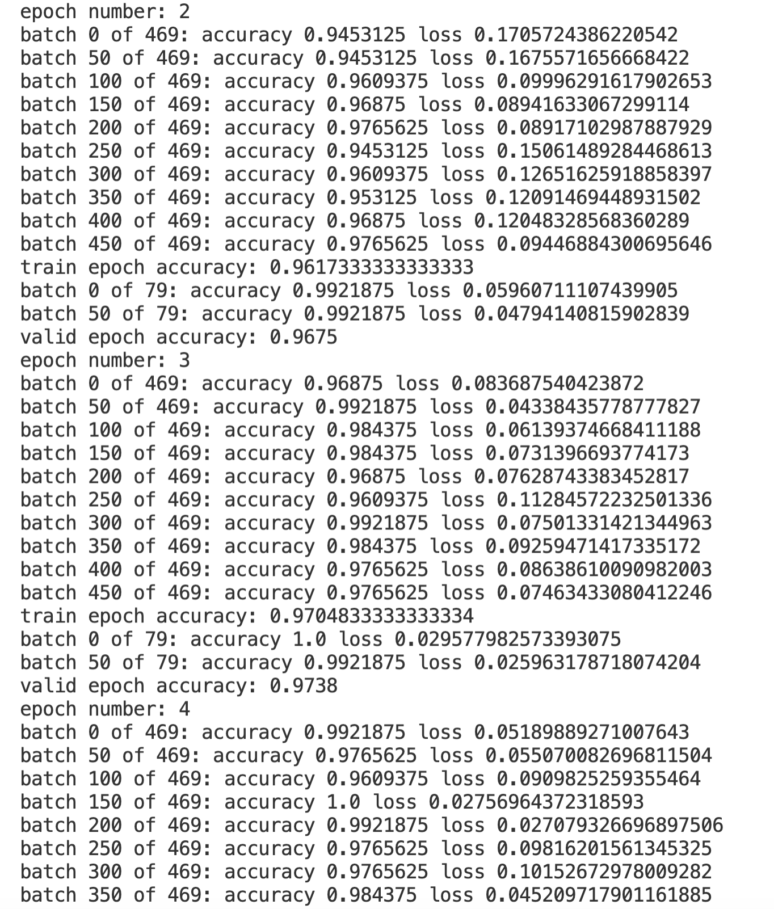
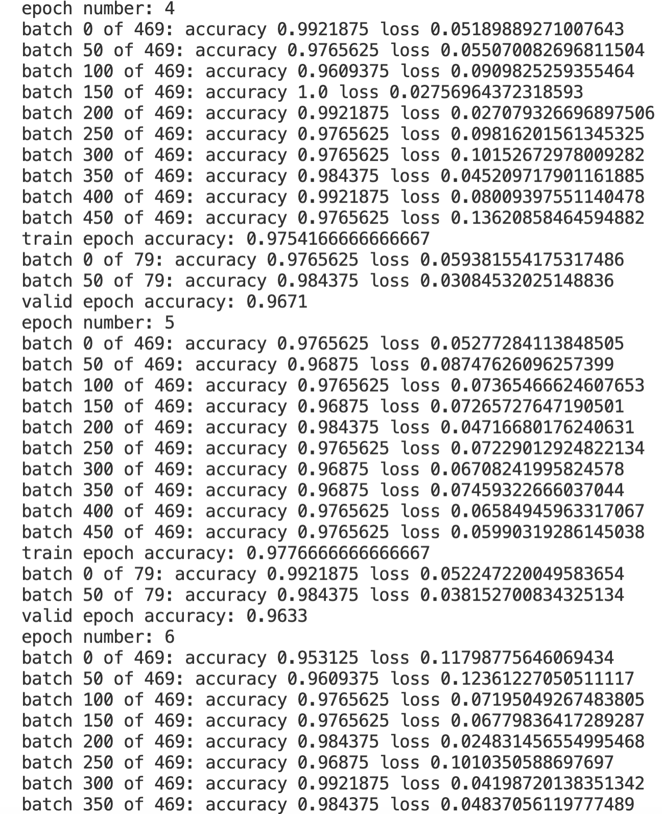

### 作业和思考
- 实现全联接神经网络
- 调整参数到验证集效果最好
- 汇报这个效果

### 作业代码过程
- 1. 从https://github.com/johnny-richards/PyCandle.git
网站中下载代码进行学习
- 2. 新建datasets/mnist，并从网站上下载mnist的4个压缩包数据集，在根目录下执行 ```python3 main.py```
- 3. 模型的可调参数为
``` python 
    num_epochs = 20
    lr = 0.001
    # mu = 0.9
    weight_decay = 0.0001
    batch_size = 128
    print_every = 50
```
- 4. 如果不修改参数的设置，可以看到结果如下图所示：
    第0个epoch到第1个epoch结果如下图，
    训练集合精确度为epoch 0: 0.88955, epoch 1: 0.94905
    验证集合精确度为epoch 0: 0.9365, epoch 1: 0.9569
    

    第2个epoch到第3个epoch结果如下图，
    训练集合精确度为epoch 2: 0.9617, epoch 3: 0.94905
    验证集合精确度为epoch 2: 0.9705, epoch 3: 0.9738
    

    第3个epoch到第4个epoch结果如下图，
    训练集合精确度为epoch 4: 0.975, epoch 5: 0.978
    验证集合精确度为epoch 4: 0.967, epoch 5: 0.963
    

- 5. 通过以上可以看出，继续增加epoch对于训练结果提升已经非常有限，而且验证集合的精确度还出现了下降，因此，对于num_epochs可以缩短到4就已经足够，继续增加训练epoch没有什么太大意义。